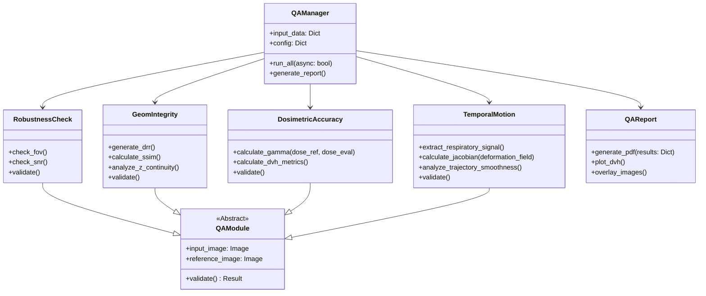

# Synthetic CT QA System Design Document

## 1. System Overview
This system validates Synthetic CTs (sCT) generated from 2D images for lung cancer IGRT/ART. It consists of four main analysis modules, a reporting engine, and an orchestration layer capable of asynchronous processing.

## 2. Class Structure (Class Diagram)



## 3. Algorithm Implementation Details

### 3.1 Gamma Analysis (Pseudo-code)
The Gamma Index $\gamma$ compares a reference dose distribution ($D_{ref}$) and an evaluated dose distribution ($D_{eval}$).

**Parameters:**
- `DD`: Dose Difference criteria (e.g., 3%)
- `DTA`: Distance to Agreement criteria (e.g., 3mm)

**Pseudo-code:**
```python
def calculate_gamma(reference_dose, eval_dose, voxel_size, dta_criteria, dose_diff_criteria):
    # Normalize doses (usually to max of reference)
    norm_factor = max(reference_dose)

    gamma_map = zeros_like(reference_dose)

    for r_voxel in reference_volume:
        min_gamma = infinity

        # Search window defined by DTA (optimization: don't search entire volume)
        search_window = define_window(r_voxel, dta_criteria)

        for e_voxel in search_window:
            # Physical distance
            distance = euclidean_dist(r_voxel, e_voxel)

            # Dose difference
            dose_diff = eval_dose[e_voxel] - reference_dose[r_voxel]

            # Gamma calculation
            gamma_val = sqrt( (distance / dta_criteria)**2 + (dose_diff / (dose_diff_criteria * norm_factor))**2 )

            if gamma_val < min_gamma:
                min_gamma = gamma_val

        gamma_map[r_voxel] = min_gamma

    pass_rate = count(gamma_map < 1.0) / total_voxels
    return pass_rate, gamma_map
```
*Note: In implementation, we will use `pymedphys.gamma` for optimized vectorization.*

### 3.2 Jacobian Determinant for 4D Analysis (Pseudo-code)
Used to evaluate local expansion/compression during Deformable Image Registration (DIR).

**Pseudo-code:**
```python
def calculate_jacobian_determinant(displacement_field):
    # displacement_field is a vector field (x, y, z) at each voxel

    # Calculate gradients
    # du/dx, du/dy, du/dz
    # dv/dx, dv/dy, dv/dz
    # dw/dx, dw/dy, dw/dz
    grads = compute_gradients(displacement_field)

    jacobian_map = zeros_like(displacement_field_scalar)

    for voxel in volume:
        # Jacobian Matrix J = I + Gradient(displacement)
        # J = [ 1 + du/dx,    du/dy,    du/dz ]
        #     [    dv/dx, 1 + dv/dy,    dv/dz ]
        #     [    dw/dx,    dw/dy, 1 + dw/dz ]

        matrix = identity_matrix + grads[voxel]
        det = determinant(matrix)

        jacobian_map[voxel] = det

    # Interpretation:
    # det < 0: Folding (Physically impossible, Error)
    # det < 1: Compression
    # det > 1: Expansion (e.g., lung inhalation)
    # det = 1: Volume preservation

    return jacobian_map
```
*Note: We will use SimpleITK's `DisplacementFieldJacobianDeterminantFilter`.*

## 4. Parallelization & Linux Integration Strategy

### Strategy
For a clinical QA system processing large DICOM datasets (especially 4D CT), serial processing is inefficient.

1.  **Task Queue (Celery + Redis)**:
    *   **Architecture**: The Web UI or Watcher script pushes QA tasks to a Redis queue.
    *   **Workers**: Multiple Celery workers (running on Linux) consume tasks.
    *   **Benefit**: Scalable across multiple servers.
    *   **Implementation**: `tasks.py` decorated with `@celery.task`.

2.  **Local Parallelism (Multiprocessing)**:
    *   For a single server instance without a broker, use Python's `concurrent.futures.ProcessPoolExecutor`.
    *   Modules like `GeomIntegrity` and `DosimetricAccuracy` can run in parallel for the same patient.

### Proposed Implementation
We will implement an `AsyncRunner` class that abstracts the execution.

```python
# executor.py
from concurrent.futures import ProcessPoolExecutor

def run_module(module_class, data):
    module = module_class(data)
    return module.validate()

class AsyncQARunner:
    def process_patient(self, patient_data):
        modules = [GeomIntegrity, DosimetricAccuracy, TemporalMotion, RobustnessCheck]
        results = {}

        with ProcessPoolExecutor(max_workers=4) as executor:
            future_to_module = {executor.submit(run_module, m, patient_data): m for m in modules}
            for future in as_completed(future_to_module):
                results[future_to_module[future].name] = future.result()

        return results
```
